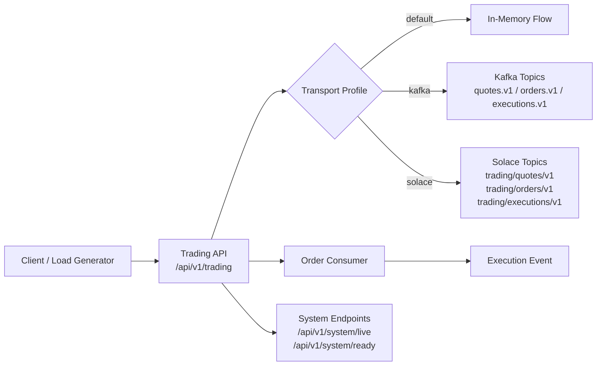

# Java Trading PoC

[](https://github.com/<your-username>/java-trading-poc/actions/workflows/ci.yml)

Low-latency style Java trading proof of concept aligned to an FX electronic trading role. The project demonstrates:

- event-driven flow with Kafka as primary transport
- optional Solace transport path for enterprise broker breadth
- measurable GC baseline and tuning comparison
- Docker-based local reproducibility

## Why This Project

This repo is designed to show practical engineering signals for a Java trading backend role:

- Java 17 + Spring Boot service design
- asynchronous messaging patterns
- performance and GC evidence, not anecdotal tuning
- clear runbook for reviewers to validate quickly

## Architecture



## Tech Stack

- Java 17 (SDKMAN managed)
- Spring Boot 3.3.5
- Maven
- Kafka (Bitnami KRaft image)
- Solace PubSub+ Standard + JCSMP
- Docker + Docker Compose
- GitHub Actions CI

## Quick Start

### 1) Prerequisites

- Java 17
- Maven
- Docker

If SDKMAN is installed:

```bash
source "$HOME/.sdkman/bin/sdkman-init.sh"
sdk env
```

### 2) Build and test

```bash
mvn -B test
```

## Run Paths

### Local app only (in-memory transport)

```bash
mvn spring-boot:run
```

### Kafka runtime

```bash
docker compose up -d kafka app
./scripts/smoke-test.sh
```

### Solace runtime (optional)

```bash
docker compose up -d solace app-solace
./scripts/smoke-test-solace.sh
```

## API Samples

### Health

```bash
curl -s http://localhost:8080/api/v1/system/live
curl -s http://localhost:8080/api/v1/system/ready
```

### Publish quote

```bash
curl -X POST http://localhost:8080/api/v1/trading/quotes \
  -H "Content-Type: application/json" \
  -d '{"symbol":"EURUSD","bid":1.0810,"ask":1.0812,"timestamp":"2026-03-15T00:00:00Z"}'
```

### Process order

```bash
curl -X POST http://localhost:8080/api/v1/trading/orders \
  -H "Content-Type: application/json" \
  -d '{"orderId":"ord-1","symbol":"EURUSD","side":"BUY","quantity":100000,"timestamp":"2026-03-15T00:00:00Z"}'
```

## Benchmark and GC

Baseline and tuned runs:

```bash
./scripts/run-gc-baseline.sh
./scripts/run-g1gc-comparison.sh
```

Key current finding:

- tuned G1 profile reduced worst observed GC pause
- tuned profile regressed throughput and p99 latency under medium/high load
- baseline G1 profile remains the default recommendation in this repo

## Messaging Decision Snapshot

- Primary: Kafka for stronger CI-friendly integration testing and broad ecosystem familiarity
- Optional extension: Solace for enterprise broker exposure and explicit tradeoff analysis

## CI

GitHub Actions workflow is defined in `.github/workflows/ci.yml` and runs:

```bash
mvn -B test
```

## Next Improvements

- add queue-backed Solace durable consumer path
- add optional ZGC comparison run
- tighten portfolio polish before public publish
