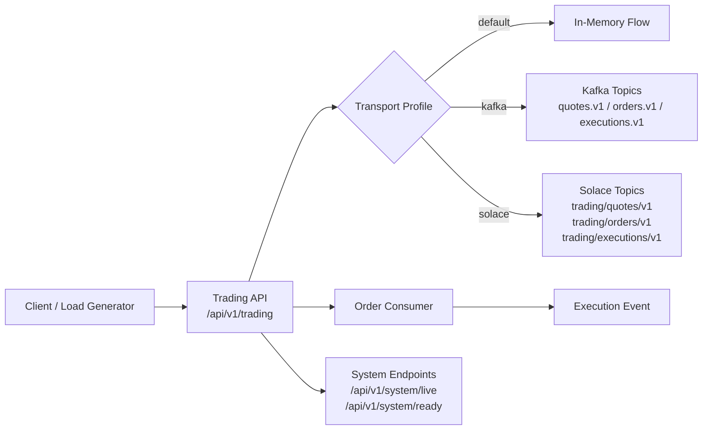

# Java Trading PoC

[](https://github.com/<your-username>/java-trading-poc/actions/workflows/ci.yml)

Low-latency style Java trading proof of concept aligned to an FX electronic trading role. The project demonstrates:

- event-driven flow with Kafka as primary transport
- optional Solace transport path for enterprise broker breadth
- measurable GC baseline and tuning comparison
- Docker-based local reproducibility

## Why This Project

This repo is designed to show practical engineering signals for a Java trading backend role:

- Java 17 + Spring Boot service design
- asynchronous messaging patterns
- performance and GC evidence, not anecdotal tuning
- clear runbook for reviewers to validate quickly

## Architecture



## Tech Stack

- Java 17 (SDKMAN managed)
- Spring Boot 3.3.5
- Maven
- Kafka (Apache image in KRaft mode)
- Solace PubSub+ Standard + JCSMP
- Docker + Docker Compose
- GitHub Actions CI

## Quick Start

### 1) Prerequisites

- Java 17
- Maven
- Docker

If SDKMAN is installed:

```bash
source "$HOME/.sdkman/bin/sdkman-init.sh"
sdk env
```

### 2) Build and test

```bash
mvn -B test
```

## Run Paths

### Local app only (in-memory transport)

```bash
mvn spring-boot:run
```

### Kafka runtime

```bash
docker compose up -d kafka app
./scripts/smoke-test.sh
```

### Solace runtime (optional)

```bash
docker compose up -d solace app-solace
./scripts/smoke-test-solace.sh
```

## API Samples

### Health

```bash
curl -s http://localhost:8080/api/v1/system/live
curl -s http://localhost:8080/api/v1/system/ready
```

### Publish quote

```bash
curl -X POST http://localhost:8080/api/v1/trading/quotes \
  -H "Content-Type: application/json" \
  -d '{"symbol":"EURUSD","bid":1.0810,"ask":1.0812,"timestamp":"2026-03-15T00:00:00Z"}'
```

### Process order

```bash
curl -X POST http://localhost:8080/api/v1/trading/orders \
  -H "Content-Type: application/json" \
  -d '{"orderId":"ord-1","symbol":"EURUSD","side":"BUY","quantity":100000,"timestamp":"2026-03-15T00:00:00Z"}'
```

## Benchmark and GC

Baseline and tuned runs:

```bash
./scripts/run-gc-baseline.sh
./scripts/run-g1gc-comparison.sh
```

Key current finding:

- tuned G1 profile reduced worst observed GC pause
- tuned profile regressed throughput and p99 latency under medium/high load
- baseline G1 profile remains the default recommendation in this repo

## Messaging Decision Snapshot

- Primary: Kafka for stronger CI-friendly integration testing and broad ecosystem familiarity
- Optional extension: Solace for enterprise broker exposure and explicit tradeoff analysis

## Explaination of This PoC

This project is a compact Java 17 and Spring Boot trading backend proof of concept. It is designed to demonstrate practical engineering signals for a Java trading role rather than simulate a full trading platform.

At a high level, the application exposes REST endpoints for quote and order events. The API layer passes requests into a small service layer, which then delegates to transport-specific implementations. The same trading flow can run in three modes:

- in-memory for the simplest baseline
- Kafka as the primary event-driven transport
- Solace as an optional enterprise broker comparison path

The key architectural choice is that the controller and service layers are transport-agnostic. Messaging details are hidden behind interfaces, so the runtime can switch between implementations without changing the API contract.

### What The Project Demonstrates

- Java 17 and Spring Boot service design
- transport abstraction behind interfaces
- asynchronous event-driven flow
- Dockerized local reproducibility
- smoke-tested runtime validation
- benchmark-backed JVM and GC analysis
- enterprise broker exposure through Solace

### How The Main Flow Works

1. HTTP requests enter through the trading API
2. Quote requests are published through the configured transport
3. Order requests are consumed and turned into execution events
4. The active runtime profile determines whether the transport is in-memory, Kafka, or Solace

### Why Kafka Is The Primary Path

Kafka is the primary implementation because it gives the best balance of:

- local reproducibility
- CI-friendly integration testing
- familiar event-driven backend patterns
- straightforward Spring integration

Solace was added as an optional comparison path to show enterprise broker exposure and transport substitution rather than to suggest the app needs multiple brokers in production.

### Why The Business Logic Is Intentionally Simple

The project is intentionally small in business scope. It does not try to model a full trading platform with matching, persistence, replay, or risk controls.

That is deliberate. The goal is to make the architecture, messaging design, operational setup, and performance measurements easy for a reviewer to understand quickly.

### Performance And GC Story

This repo includes a load generator and GC comparison scripts so performance decisions are based on measurements rather than assumptions.

The main finding was:

- tuned G1 reduced the worst observed GC pause
- tuned G1 hurt throughput and p99 latency under medium and high load
- baseline G1 remained the better default recommendation

That was an intentional part of the project: showing evidence-based tuning rather than cargo-cult JVM optimization.

### Short POC Version

This is a compact event-driven trading backend slice built with Java 17 and Spring Boot. The API and service layers are transport-agnostic, and Spring profiles switch between in-memory, Kafka, and Solace implementations. That let me demonstrate clean separation of concerns, messaging integration, Dockerized reproducibility, smoke-tested runtime validation, and benchmark-driven GC decisions in a small, reviewable project.

## CI

GitHub Actions workflow is defined in `.github/workflows/ci.yml` and runs:

```bash
mvn -B test
```

## Next Improvements

- add queue-backed Solace durable consumer path
- add optional ZGC comparison run
- tighten portfolio polish before public publish
